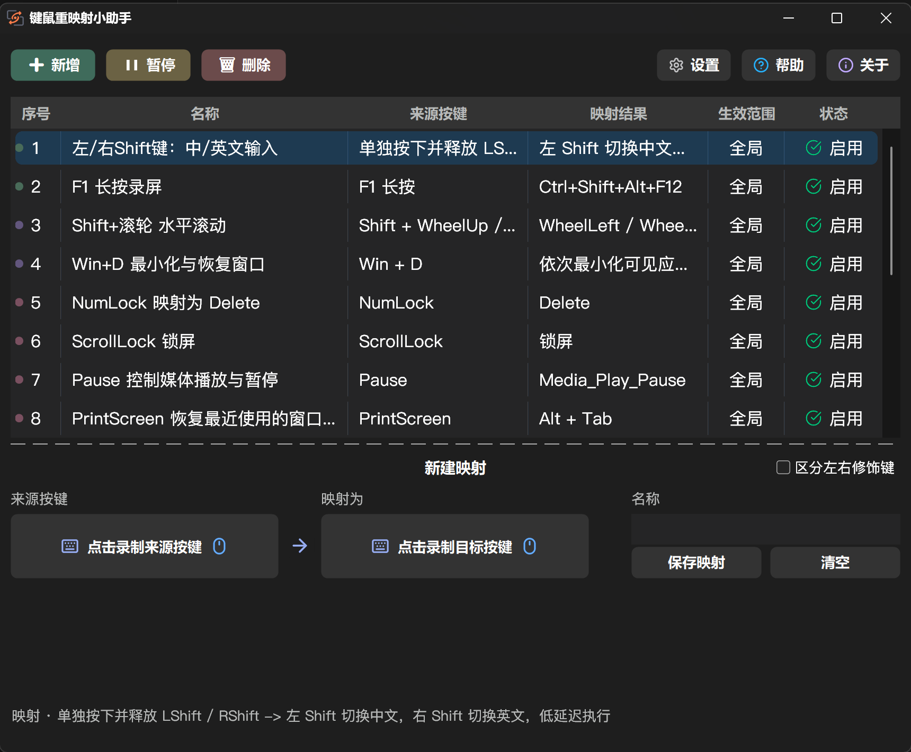
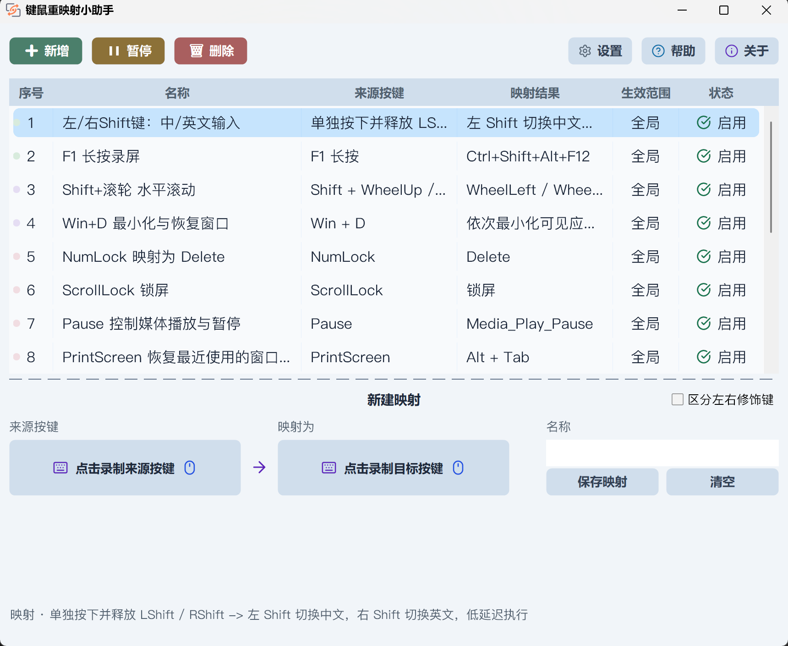

<div align="center">
  

  <p><a href="../README.md">简体中文</a> · <strong>繁體中文（香港）</strong> · <a href="./README.zh-TW.md">繁體中文（台灣）</a> · <a href="./README.en.md">English</a> · <a href="./README.ja.md">日本語</a> · <a href="./README.vi.md">Tiếng Việt</a> · <a href="./README.ko.md">한국어</a> · <a href="./README.es.md">Español</a> · <a href="./README.fr.md">Français</a> · <a href="./README.pt-BR.md">Português</a> · <a href="./README.ru.md">Русский</a> · <a href="./README.de.md">Deutsch</a> · <a href="./README.it.md">Italiano</a></p>

  <h1>鍵鼠重映射小助手</h1>

  <p><strong>錄製、編寫及管理真正配合個人工作流程的鍵盤與滑鼠映射</strong></p>

  <p>
    <a href="https://github.com/realSilasYang/key-mouse-remapper-assistant/releases/latest"></a>
    <a href="https://github.com/realSilasYang/key-mouse-remapper-assistant/releases"></a>
    <a href="../LICENSE"></a>
    
    
  </p>

  <p><a href="#介面概覽">介面概覽</a> · <a href="#使用指南">使用指南</a> · <a href="#4-規則區塊與受託管指令碼">規則形式</a> · <a href="https://github.com/realSilasYang/key-mouse-remapper-assistant/releases">版本發佈</a> · <a href="../CHANGELOG.md">更新日誌</a> · <a href="https://github.com/realSilasYang/key-mouse-remapper-assistant/issues/new">問題回報</a> · <a href="#開發者指南">開發者指南</a></p>
</div>

鍵鼠重映射小助手是供 Windows 10／11 x64 使用的 AutoHotkey v2 桌面工具，把按鍵錄製、規則管理、程式碼編輯、AI 產生與最佳化、本機驗證及執行狀態集中在同一介面。版本 1.0.2 內置 18 條可編輯規則，包括 13 條規則區塊及 5 條受託管指令碼。

規則儲存在可讀、可備份的 `@mapping` 註解區域。程式不安裝驅動程式或 Windows 服務，映射只會在小助手運行時生效。正式發佈包不會包含製作電腦的 AI 位址、API 金鑰、模型、自訂提示詞或其他個人設定。

# 介面概覽

<p align="center">
  
</p>
<p align="center">
  
</p>

上方指令列用來新增、批量暫停／恢復及刪除規則；中間清單顯示次序、名稱、來源按鍵、映射結果、生效範圍及即時狀態；下方可直接錄製來源與目標。清單支援多選、批量拖曳、暫時排序、完整內容提示、彩色次序圓點及穩定的圓角選取背景。

## 主要功能

- 錄製鍵盤、滑鼠按鈕、滾輪及常見瀏覽器／媒體／啟動鍵，並分辨左右修飾鍵。
- 支援按下、放開、重複、短按、長按、同時鍵，以及應用程式、視窗、輸入法與工作階段條件。
- 規則區塊在主程序即時套用；完整 AHK v2 指令碼在獨立受管程序運行。
- AI 由同一入口自行判斷規則形式，結果須經格式正規化、RuleSpec 驗證及 AHK v2 語法／啟動驗證。
- 編輯器提供語法醒目提示、差異行醒目提示、復原、重做、刪除行及固定兩行捲動。
- 新增、修改、刪除、暫停／恢復、規則包匯入及拖曳排序均可復原或重做。
- 支援 13 種介面語言、跟隨系統／淺色／深色主題、管理員運行、開機啟動及自動更新。

## 使用限制

- 只支援 Windows 10／11 x64。
- 不安裝核心驅動程式，無法處理安全桌面、`Ctrl+Alt+Delete` 或刻意阻擋使用者模式掛鉤的軟件。
- 映射只可影響相同或較低完整性層級的程序；預設管理員模式會讓規則區塊及受託管指令碼一同提升權限。
- AI 結果通過本機驗證後仍須由使用者審閱，特別是可執行任意程式碼的受託管指令碼。

---

**[使用指南](#使用指南)**<br>
[安裝](#1-安裝與首次運行) · [管理](#2-添加和管理映射) · [錄製](#3-錄製狀態與事件) · [規則與 AI](#4-規則區塊受託管指令碼與-ai) · [設定](#5-設定) · [私隱](#6-事件診斷和私隱)

**[開發者指南](#開發者指南)**<br>
[目錄](#1-目錄與職責) · [邊界](#2-正確性邊界) · [驗證](#3-驗證命令) · [發佈](#4-發佈與貢獻)

# 支持項目

如果小助手改善了您的日常操作，歡迎使用下方二維碼支持開發：

<p align="center">&nbsp;&nbsp;&nbsp;&nbsp;</p>

# 使用指南

## 1. 安裝與首次運行

從 [Releases](https://github.com/realSilasYang/key-mouse-remapper-assistant/releases) 下載完整便攜 ZIP 或完整原始碼 ZIP，並完整解壓到可寫入的資料夾。便攜版執行 `鍵鼠重映射小助手.exe`，已包含固定 AutoHotkey v2 x64 執行環境；原始碼版須自行安裝 AutoHotkey v2 x64 後執行 `鍵鼠重映射小助手.ahk`。

兩個程式 ZIP 均不包含字型。可選的 `fonts.zip` 提供 Noto 後備字型；按需要把字型安裝到 Windows 後，小助手會按原有優先次序選用。程式只列舉 Windows 已安裝字型，不會從 ZIP 或程式目錄私下載入。字型不是運行所必需。

首次啟動預設要求管理員權限。關閉主視窗只會隱藏到系統匣；要停止所有映射，請在系統匣選單選擇「退出程式」。便攜版並非單一檔案，移動或備份時要保留整個資料夾。

## 2. 添加和管理映射

「新增」會開啟完整 `@mapping` 編輯器或 AI 產生入口。雙擊、F2 或右鍵選單可編輯；多選後可批量暫停、恢復、刪除、拖曳排序或設定次序圓點。表頭排序只影響當前顯示，不會改寫原始碼次序。主清單使用 `Ctrl+Z` 復原及 `Ctrl+Shift+Z` 重做。

## 3. 錄製、狀態與事件

依次錄製來源和目標、輸入名稱，按需要啟用左右修飾鍵區分，再儲存映射。錄製期間，小助手會暫停現有映射並啟動專用輸入保護，待所有實體按鍵放開後才恢復，避免規則或系統快捷鍵搶走輸入。

## 4. 規則區塊、受託管指令碼與 AI

| 形式 | 適合情況 | 執行方式 |
| --- | --- | --- |
| 規則區塊 | 單一觸發來源、組合鍵、短按／長按／放開分支、條件及標準動作 | 解析註解化 JSON 後在主程序即時套用 |
| 受託管指令碼 | 多個獨立快捷鍵、共享狀態、迴圈、計時器、自訂函式、外部呼叫或任意 AHK v2 | 由小助手在獨立 AutoHotkey 程序啟動、暫停、恢復及停止 |

受託管指令碼可執行任意程式碼，因此新增或匯入時必須明確確認。不要重複宿主注入的指示詞，亦不要使用 `#SingleInstance Force`、無條件 `ExitApp` 或 `Reload` 破壞受管生命週期。

### AI 產生與最佳化

在設定中填寫 API 位址、金鑰和模型並先測試連線。產生只有一個入口，AI 會根據完整能力邊界選擇規則區塊或受託管指令碼。產生內容直接進入編輯器；最佳化會先顯示有語法及差異行醒目提示的審閱畫面。

本機會清除包裝文字、正規化已知欄位、驗證按鍵名稱和 RuleSpec 語義，並進行 AHK v2 語法或啟動驗證。失敗、拒絕或取消都不會覆蓋原規則，下一次亦會保留上次輸入。只有主動使用 AI 功能時才會把相關內容傳送到使用者設定的第三方服務。

## 5. 設定

設定包括介面語言、字型、主題、捷徑、計劃工作、管理員模式、啟動更新檢查、AI 連線、規則包及事件容量。事件檢視器可篩選輸入、匹配、條件拒絕、動作、儲存及系統事件，亦可匯出 JSONL；分享前請先檢查敏感資料。

## 6. 事件、診斷和私隱

規則儲存在實際運行目錄的 `鍵鼠重映射小助手.ahk`；AI、顯示和啟動設定位於 `%APPDATA%\KeyMouseRemapperAssistant`。請同時備份兩處。正式發佈包固定包含目前 18 條內置規則，但排除 `settings.ini`、`runtime.ini`、`rule-appearance.json`、`window-layout.ini` 及所有本機 AI 參數。項目沒有遙測或自動上載。

# Star History

[](https://star-history.com/#realSilasYang/key-mouse-remapper-assistant&Date)

# 開發者指南

## 1. 目錄與職責

`app/` 負責應用程式及視窗；`src/Core/` 負責規則、執行、AI、歷史、規則包和更新；`src/Input/` 負責觀察與錄製；`src/Localization/` 負責 13 種語言；`src/Platform/` 及 `src/UI/` 負責 Windows 整合與介面；`tests/` 和 `tools/` 負責驗證及發佈。

## 2. 正確性邊界

規則區塊透過主程序的 `Hotkey()` 運行；受託管指令碼使用帶停止、暫停及就緒訊號的獨立程序；錄製只在需要時啟動專用保護。規則寫入採用跨程序鎖、快照比較及原子替換。安全桌面與安全注意序列始終不在使用者模式程式的能力範圍內。

## 3. 驗證命令

```powershell
.\tools\bootstrap-toolchain.ps1
.\tests\verify.ps1 -AutoHotkeyPath .\.tools\autoHotkey-2.0.26\AutoHotkey64.exe -IncludeGui
.\tools\build-release.ps1
```

## 4. 發佈與貢獻

構建會產生完整便攜 ZIP、完整原始碼 ZIP 及可選的 `fonts.zip`。兩個程式包均不包含字型；字型包供安裝到 Windows。構建會拒絕本機使用者狀態和 AI 參數，並以確定性方式建立 ZIP。版本規範見[更新日誌模板](changelog-template.md)及[發佈流程](release-process.md)。

### 授權條款

本項目使用 [MIT License](../LICENSE)，第三方元件詳見 [THIRD_PARTY_NOTICES.md](../THIRD_PARTY_NOTICES.md)。
